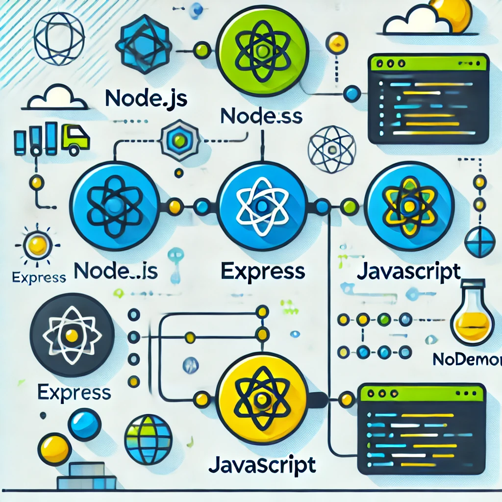

# Projeto de API com Node.js e Express



## Sobre o Projeto

Esta é uma aplicação básica de API REST construída com **Node.js** e **Express**. A API tem funcionalidades simples para gerenciar um sistema de itens, permitindo operações de leitura (GET) e criação (POST) de itens. O projeto foi desenvolvido com uma estrutura organizada para rotas, controladores e modelos, com suporte ao **nodemon** para reload automático durante o desenvolvimento.

## Tecnologias Utilizadas

- [Node.js - Ambiente de execução JavaScript](https://nodejs.org/pt)
- [Express - Framework web para Node.js](https://expressjs.com/pt-br/)
- [Nodemon - Ferramenta que reinicia automaticamente o servidor durante o desenvolvimento](https://www.npmjs.com/package/nodemon)
- [JavaScript - Linguagem de programação utilizada](https://developer.mozilla.org/pt-BR/docs/Web/JavaScript)

## Como Rodar

### Pré-requisitos

- [Node.js](https://nodejs.org/en/) instalado na máquina.
- Gerenciador de pacotes [npm](https://www.npmjs.com/) (normalmente instalado junto com o Node.js).

### Passos para rodar o projeto

1. **Clonar o repositório**:

```bash
## Clone o projeto
git clone https://github.com/kaiqueCovo/template-api-nodejs-express.git

## Entre na pasta do projeto
cd template-api-nodejs-express.git

## Instale as dependências
npm install

## Inicie o projeto
npm run dev
```

Made with ♥ by [Kaique Covo](www.linkedin.com/in/kaiquecovo) :wave:
